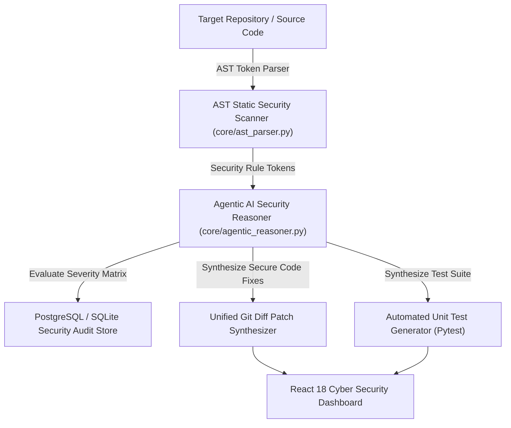

# 🛡️ SentinelAI — Autonomous Agentic AI Code Security & Vulnerability Auditor

[](https://www.python.org/)
[](https://react.dev/)
[](https://www.typescriptlang.org/)
[](https://www.postgresql.org/)
[](https://www.docker.com/)

An enterprise-grade, autonomous **Agentic AI Code Security & Vulnerability Auditor** (**SentinelAI**). Built for AST static security code scanning, automated vulnerability detection (SQL Injections, Hardcoded Secrets, XSS, Path Traversal), unified Git diff patch synthesis, unit test generation, and interactive Cyber Security Dashboard visualization.

---

## 🏛️ Architecture & System Design



---

## 🌟 Key Features

- 🔍 **Abstract Syntax Tree (AST) Security Parser**: Scans codebases for AST pattern violations (CWE-89 SQLi, CWE-798 Secrets, CWE-79 XSS, CWE-22 Path Traversal).
- 🤖 **Autonomous Agentic AI Reasoner**: Evaluates code vulnerability context, calculates repository risk scores, and synthesizes 1-click code remediation patches.
- 📜 **Unified Git Diff Patch Synthesizer**: Generates standard unified diff patches (`--- a/file +++ b/file`) showing original vs. AI-remediated code.
- 🧪 **Automated Security Unit Test Generator**: Synthesizes Pytest unit test suites that verify vulnerability fixes.
- 💻 **Cyber Violet React Dashboard**: Interactive security matrix table, live AST audit log stream, risk score metrics, and side-by-side code diff viewer.

---

## 🗄️ Database Architecture (`db/schema.sql`)

- `audit_scans`: Stores scan history, total lines audited, and repository risk scores (0–100).
- `vulnerabilities`: Log table detailing file path, line number, CWE ID, severity rating, and description.
- `code_patches`: Stores original code, AI-patched code, and unified diff strings.
- `generated_tests`: Stores synthesized unit test suites.

---

## 🚀 Quick Start

### 1. Local Browser Viewing
Simply open `index.html` in your web browser:
```bash
open c:/yared-projects/sentinel-ai-code-auditor/index.html
```

### 2. Run Python Audit REST API Server
```bash
cd c:/yared-projects/sentinel-ai-code-auditor
python -m core.api_server
```

---

## 👨‍💻 Author

**Yared Kinetibeb Tesfaye**
* 🎓 5th-Year Computer Engineering Senior @ Addis Ababa Science and Technology University (AASTU)
* 🌐 Live Portfolio: [yaya2127.github.io/Personal-Portfolio](https://yaya2127.github.io/Personal-Portfolio/)
* 💼 LinkedIn: [linkedin.com/in/yared-kinetibeb-3b788b350](https://www.linkedin.com/in/yared-kinetibeb-3b788b350/)
* 📧 Email: [kinetibebyared@gmail.com](mailto:kinetibebyared@gmail.com)
