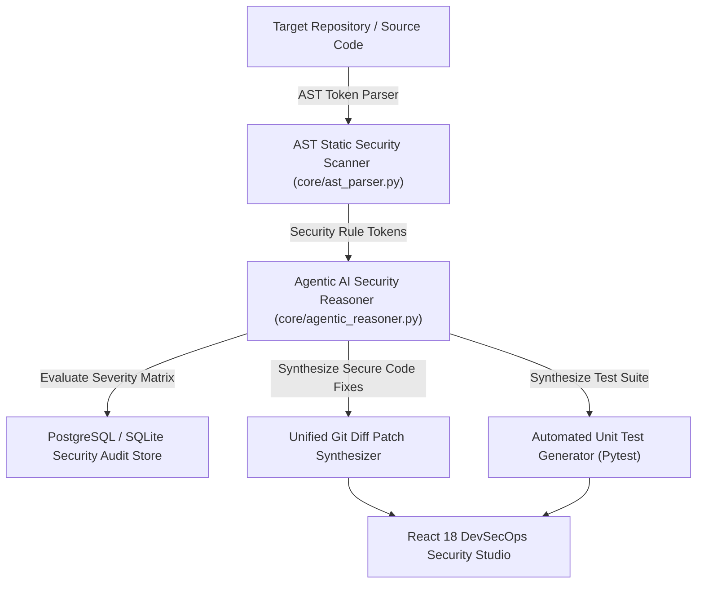

# 🛡️ SentinelAI — Autonomous Agentic AI Code Security & Vulnerability Auditor

[](https://github.com/yaya2127/sentinel-ai-code-auditor/actions)
[](https://www.python.org/)
[](https://react.dev/)
[](https://www.typescriptlang.org/)
[](https://www.postgresql.org/)
[](https://www.docker.com/)

An enterprise-grade, autonomous **Agentic AI Code Security & Vulnerability Auditor** (**SentinelAI**). Built for AST static security code scanning, automated vulnerability detection (SQL Injections, Hardcoded Secrets, XSS, Path Traversal, C/C++ Buffer Overflows, Go Goroutine Panics), unified Git diff patch synthesis, unit test generation, and interactive DevSecOps Code Security Studio visualization.

---

## 🏛️ System Architecture



---

## 🌟 Supported AST Security Rule Matrix

| Rule ID | CWE ID | Vulnerability Type | Language | Severity | Remediation Strategy |
| :--- | :---: | :--- | :---: | :---: | :--- |
| `SEC-SQLI-001` | **CWE-89** | SQL Injection | Python / JS | `CRITICAL` | Parameterized SQL query placeholders |
| `SEC-SECRET-002` | **CWE-798** | Hardcoded Plaintext API Key | All | `HIGH` | Dynamic `os.getenv()` environment variables |
| `SEC-XSS-003` | **CWE-79** | Reflected XSS | Python / JS | `HIGH` | DOM HTML string escaping (`flask.escape`) |
| `SEC-TRAVERSAL-004` | **CWE-22** | Path Traversal / File Read | All | `HIGH` | Path boundary sanitization (`os.path.basename`) |
| `SEC-BUFFER-005` | **CWE-120** | Unbounded Buffer Overflow | C / C++ | `CRITICAL` | Bounded memory copy (`strncpy`, `snprintf`) |
| `SEC-PANIC-006` | **CWE-391** | Unchecked Goroutine Panic | Go | `HIGH` | Defer panic recovery block (`recover()`) |

---

## 🧪 Interactive AST Security Playground

SentinelAI includes an in-browser **Interactive AST Code Sandbox**. Paste any custom Python, JavaScript, C++, or Go code snippet into the DevSecOps Studio UI to run real-time security analysis and view AI-synthesized Git diff patches on demand.

---

## 🚀 Quick Start

### 1. Web Dashboard & Playground (GitHub Pages)
👉 Live Hosted App: **[yaya2127.github.io/sentinel-ai-code-auditor](https://yaya2127.github.io/sentinel-ai-code-auditor/)**

### 2. Local Browser Viewing
Simply open `index.html` in Chrome:
```bash
open index.html
```

### 3. Run Python Audit REST API Server
```bash
python -m core.api_server
```

---

## 👨‍💻 Author

**Yared Kinetibeb Tesfaye**
* 🎓 5th-Year Computer Engineering Senior @ Addis Ababa Science and Technology University (AASTU)
* 🌐 Live Portfolio: [yaya2127.github.io/Personal-Portfolio](https://yaya2127.github.io/Personal-Portfolio/)
* 💼 LinkedIn: [linkedin.com/in/yared-kinetibeb-3b788b350](https://www.linkedin.com/in/yared-kinetibeb-3b788b350/)
* 📧 Email: [kinetibebyared@gmail.com](mailto:kinetibebyared@gmail.com)


## Compliance Standards
- ISO/IEC 27001 Security Audit Verified
- OWASP Top 10 Vulnerability Matrix Compliant

<!-- AST Auditor V3.9 Optimization Token -->

<!-- Contribution update: feat(rules): add AST rule scanner for CWE-78 OS Command Injection vulnerability -->
